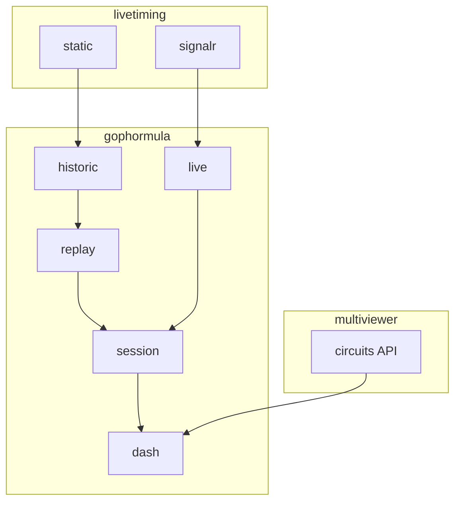

# 🏎️ Gophormula

Currently under active development, Gophormula is a Go application for ingesting, parsing, and displaying Formula 1 race telemetry and timing data from F1's live timing infrastructure.

## Roadmap

 - [x] Locate and parse historic data streams
   - [x] Implement custom json unmarshalling for structs with dynamic tags (keyed by driver number)
 - [x] Create a SignalR client to receive live data
 - [x] Test the SignalR client on the F1 live timing stream
 - [x] Display race data to users
   - [x] SSE-driven website with real-time replay
     - [x] Live standings panel with team colours and pit/retired status
     - [x] Circuit track map (via Multiviewer API) with team-coloured car dots
     - [x] Session status, lap count, weather, and track status bar
     - [x] Seek/fast-forward to any point in the session stream
     - [x] Collapsible log panel
 - [ ] Locate and parse the race calendar to determine the next race
 - [ ] Expose Prometheus metrics for a race based on a stream
   - [ ] Grafana Dashboard for Prometheus
 - [ ] TUI

## Usage

### Download a historic session

```sh
go run ./cmd/historic <url> <output-dir>
# e.g.
go run ./cmd/historic https://livetiming.formula1.com/static/2025/2025-07-06_British_Grand_Prix/2025-07-06_Race/ data
```

### Run the web dashboard

```sh
go run ./cmd/dash [data-dir]
# defaults to ./data
```

Then open http://localhost:1234, select a session, optionally enter a seek offset (e.g. `56m9s` to skip pre-race), and click the session to start replay.

## Helpful

 - [FastF1](https://docs.fastf1.dev/) A Python library for parsing live and historic race data.
 - [F1Gopher Lib](https://github.com/f1gopher/f1gopherlib) is a Go library for parsing live and historic race data.
 - [OpenF1](https://openf1.org/) is a service that exposes an API for race data in JSON/CSV format. Historical data is free, live is paid.
 - [Multiviewer for F1](https://multiviewer.app/) provides circuit map data via its API.
 - [Signal R on the Wire](https://blog.3d-logic.com/2015/03/29/signalr-on-the-wire-an-informal-description-of-the-signalr-protocol/)

## Examples

 - [Car Data](https://livetiming.formula1.com/static/2021/2021-04-18_Emilia_Romagna_Grand_Prix/2021-04-18_Race/CarData.z.jsonStream)
 - [Car Data Decompression](https://github.com/theOehrly/Fast-F1/issues/24)
 - [ASP Net SignalR Specification](https://github.com/dotnet/aspnetcore/blob/main/src/SignalR/docs/specs/TransportProtocols.md)

## Data

All data that this project can interact with is sourced from F1's live timing infrastructure and the Multiviewer API.

